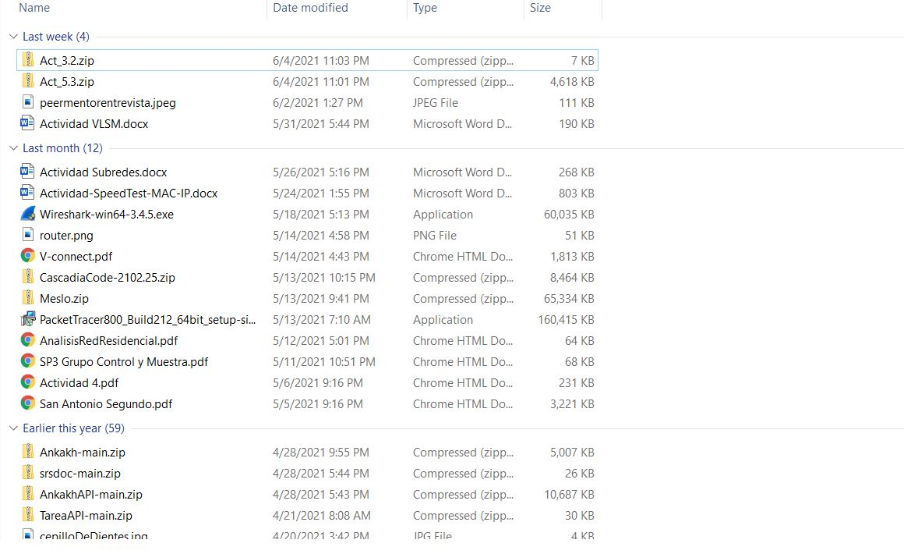
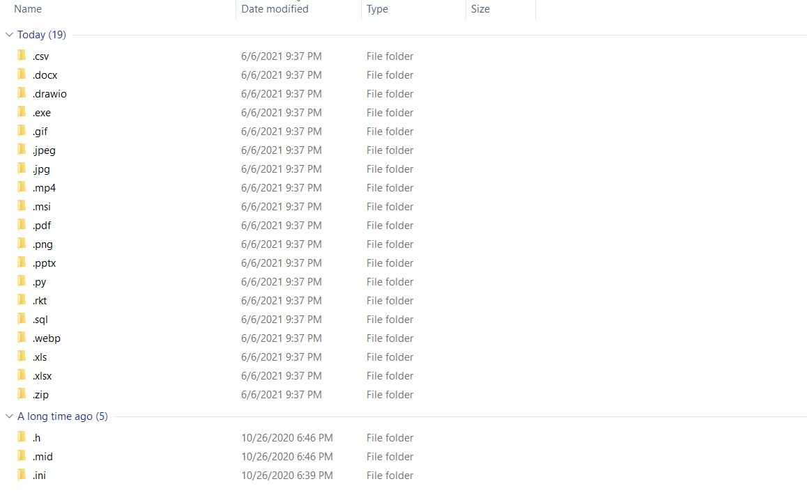
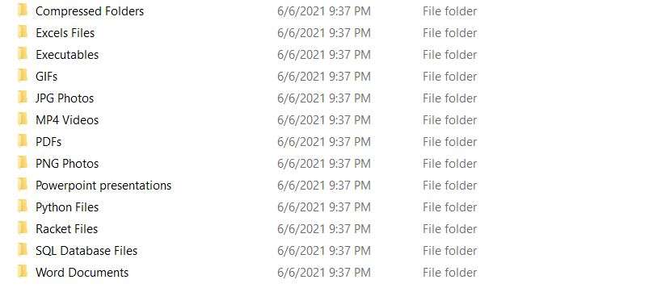

# Download Folder Organizer

Has your downloads folder ever look something like this?



Ugly isn't it?

Downloading files from the web is something we do almost everyday, and more often than not we just use them once and then leave then taking space in our downloads folder. Even worse, maybe we do need those files from time to time but we forget to move them to some other folder for easy access and every day they become more and more buried in our downloads folder. For this reason, I've made this little script that organizes each file in our downloads folder by extension name, so whether you are looking for a word document or a powerpoint presentation, instead of tediously looking in all of your files, you can find it in it’s extension folder.


For now this only works on windows, and still may have some errors. If you ever encounter one or you have some cool ideas please feel free to send me a message!

## How do I use it?

To use it just download the [organize.py](organize.py) file and run it.

To run it you'll need to have python installed. You can install it in the [official python website](https://www.python.org/).

Once installed you can either dobble click it or run this command in any terminal.

```powershell
python organize.py
```

## Output

Once you run it all your files will be ordered by extension name. I should look something like this.



If you want something more informative you could add a "-f" flag and get a more readable folder name.

For this to work you need to run the program from the terminal.

```powershell
python organize.py -f
```
The output should look somethink like this.



